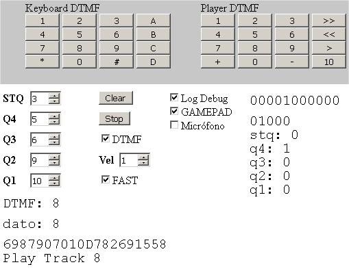
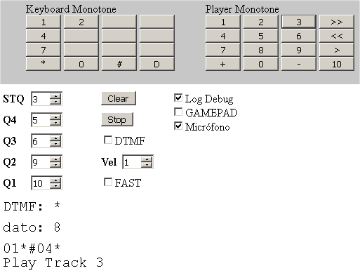

# JUKEBOX DTMF
It is a jukebox, which allows to play up to 10 MP3 files, by means of DTMF or monotone tones
in real time using microphone or gamepad (MT8870 connected to joystick), under HTML5.

 
<ul>
 <li><a href='#interface'>Interface<a/></li> 
 <li><a href='#html5'>HTML5<a/></li> 
 <li><a href='#codigo'>Código</a></li>   
</ul>
 

<a name="interface"><h2>Interface</h2></a>
Several interfaces are allowed:
<ul>
 <li>Microphone or line input</li>
 <li>Line or speaker output</li>
 <li>Joystick or gamepad modified with MT8870</li>
 <li>Arduino emulating joystick (ARDUINO UNO R3 ATMEGA 16u2 and LEONARDO)</li>
</ul>
Although using the MT8870 involves a little more difficulty, much more speed and accuracy is achieved in decoding DTMF tones.
Thanks to the MT8870 chip, connecting the STQ, Q4, Q3, Q2 and Q1 outputs to a transistor allows you to open or close
the buttons on a GAMEPAD, you can decode DTMF tones. We only need 5 pins (control buttons). 

For the construction of the same, the project must be followed: 

<a href="https://github.com/rpsubc8/dtmfgamepadchat">https://github.com/rpsubc8/dtmfgamepadchat</a>

  
<a name="html5"><h2>HTML5</h2></a>
The tones are being decoded from the microphone or the gamepad from the web browser. However, if we want to carry out a test, we can send the tones or commands both DTMF (dual frequency) and monotone (single frequency) from the keyboard displayed on the web. 
The left keyboard generates a single tone, while the right keyboard sends a player control sequence:
<ul>
 <li>0 .. 10 Play a Track (directory Tracks 0.mp3 .. 10.mp3)</li>
 <li>Previous and next Track</li>
 <li>Volume up and down</li>
 <li>Stop or play</li>
</ul>

You can adjust the playback speed of the tones, as well as select with Fast to send the least number of tones.

  
<a name="code"><h2>Code</h2></a>
We can modify:
<pre><code>
var gb_id_stq = 3; //Boton PAD for pin STQ MT8870
var gb_id_q4 = 5; // PAD button for pin Q4 MT8870
var gb_id_q3 = 6; // PAD button for pin Q3 MT8870
var gb_id_q2 = 9; //Bottom PAD for pin Q2 MT8870
var gb_id_q1 = 10; //Bottom PAD for pin Q1 MT8870
var gb_speed_dtmf = 1; //Speed sent tones 1 .. 17 (MT8870 only)
var gb_use_dtmf = true; //Detect DTMF or single tone
var gb_use_fast = false; //Fast mode reduce tones
var gb_log_debug = true; //Debug console
var gb_use_gamepad_dtmf= false;// Use gamepad
var gb_use_mic_dtmf= true; // Use microphone
</code></pre>
